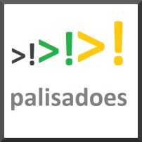
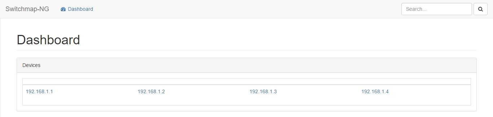
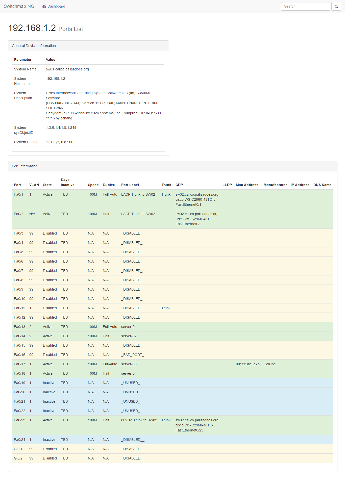

# Switchmap-NG

[💬 Join the community on Slack](https://github.com/PalisadoesFoundation/)

## About

``Switchmap-NG`` creates HTML pages that show information about a set of Ethernet switches. Python re-write of the original on SourceForge.

Switchmap is maintained by Palisadoes Foundation volunteers and Jamaican university students who participate in the Foundation's annual Calico Challenge summer internship.

1. Read our [Documentation and guidelines](http://switchmap-ng.readthedocs.io/en/latest/) on how to contribute.
1. Use our [issues page](https://github.com/PalisadoesFoundation/switchmap-ng/issues) to report any bugs or make feature requests.

## Screen Shots

Here are some sample screenshots:

### Dashboard

The dashboard shows a list of devices being polled for data.

### Switch Table

Clicking on any of the links will give interface information.

