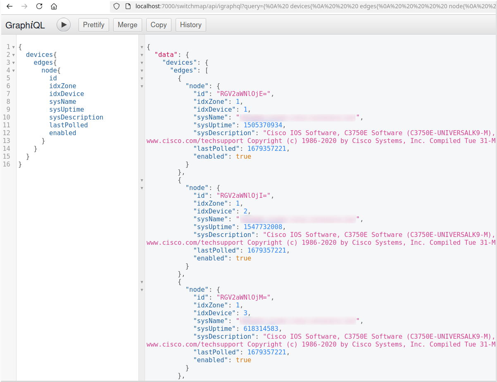

Testing
=======

Follow the installation steps above to have the application ready, then add these steps for developing code.

Making Your System an SNMP Server
---------------------------------

Switchmap uses SNMP to gather data from network devices. As a developer it may be difficult to get access to test equipment. This section outlines how to run SNMP on your local machine as an SNMP server.

#. When the server is running and correctly configured, it will provide data about its interfaces via SNMP.
#. You'll need to use an SNMP client to extract the data from the server.

Here are some links to get you started:

#. Windows 11:

   #. SNMP Server: 

      #. `Enable SNMP on Windows <https://blog.paessler.com/how-to-enable-snmp-on-your-operating-system>`_
    
   #. SNMP Client:
            
      #. Software: `Net-SNMP Download <http://www.net-snmp.org/download.html>`_
      
      #. Tutorial: `SNMP Walk Examples for Windows <https://www.itprc.com/snmpwalk-examples-for-windows/>`_

#. Ubuntu: 
   
   #. This page includes both server and client setup.
   
   #. `Ubuntu SNMP Setup Guide <https://www.digitalocean.com/community/tutorials/how-to-install-and-configure-an-snmp-daemon-and-client-on-ubuntu-18-04#step-3-configuring->`_

Testing Setup for Developers
----------------------------

Follow the installation steps above to have the application ready, then add these steps for developing code.

Database Configuration
~~~~~~~~~~~~~~~~~~~~~~

Create the ``switchmap_unittest`` database, and grant privileges to a ``switchmap_unittest`` user with the password ``switchmap_unittest``.

::
   
     $ sudo mysql
     >>> CREATE DATABASE switchmap_unittest;
     >>> GRANT ALL PRIVILEGES ON switchmap_unittest.* TO 'switchmap_unittest'@'localhost' IDENTIFIED BY 'switchmap_unittest';
     >>> FLUSH PRIVILEGES;
     >>> EXIT;

Setup the Test Config File
~~~~~~~~~~~~~~~~~~~~~~~~~~

Create the testing configuration file which will be stored in a hidden directory in ``$HOME``

::
   
   (venv) $ tests/bin/test_db_config_setup.py

API Interactive GraphQL Interaction
-----------------------------------

This is useful for:

1) Developing queries for API clients.
2) Troubleshooting your code.
3) Creating new features.

On the API server you'll be able to make GraphQL queries in an easy to use interactive web page. 

1) Enter your query in the left hand panel
2) Press the ``Play`` button
3) Observe the results

Interactive GraphQL URL
~~~~~~~~~~~~~~~~~~~~~~~

The URL on a running on your local server is:

http://localhost:7000/switchmap/api/igraphql

Interactive GraphQL Screenshot
~~~~~~~~~~~~~~~~~~~~~~~~~~~~~~

Here is a sample of what to you can do with interactive queries.

Important File Locations
------------------------

These locations are important for developers:

Module Library Layout
~~~~~~~~~~~~~~~~~~~~~

Modules are arranged like this:

1) The API modules are located in ``switchmap/server``
2) The Poller modules are located in ``switchmap/poller``
3) The Web UI modules are located in ``switchmap/dashboard``
4) Modules that are shared with all three are located in ``switchmap/core``

Database and GraphQL
~~~~~~~~~~~~~~~~~~~~

Reviewing these files will be important.

1) The Database SQLAlchemy ORM definitions can be found in the ``switchmap/server/db/models.py`` file.
2) The GraphQL schema are located in the ``switchmap/server/db/schema.py`` file.
3) The GraphQL schema attributes are located in the ``switchmap/server/db/attributes.py`` file.

Run the Test Suite
------------------

**NOTE:** The test cases are written to be run only from the root directory of the repository this to ensure no errors in importing both the required test and code modules.

You can run all the tests with this command.

::
   
   (venv) $ cd /path/to/switchmap
   (venv) $ tests/bin/_do_all_tests.py

An alternative method is to use pytest.

::
   
   (venv) $ cd /path/to/switchmap
   (venv) $ pytest tests/switchmap_

You can run individual tests with this command.

::
   
   (venv) $ cd /path/to/switchmap
   (venv) $ tests/switchmap_/path/to/test.py

Populating the Database Using the Ingester
~~~~~~~~~~~~~~~~~~~~~~~~~~~~~~~~~~~~~~~~~~

Pollers post network data to the Switchmap-NG server. The Ingester process reads this posted data and uses it to update the database. 

You may not have access to network devices for testing, however there is test data data that can be imported using the ingester.

An easy way to populate the database using this data is to:

1) Configure switchmap
2) Copy the test files in ``tests/testdata_`` to the configure ``cache_directory``
3) Start or restart the poller daemon or app
4) The updated data should now be visible in the web UI
